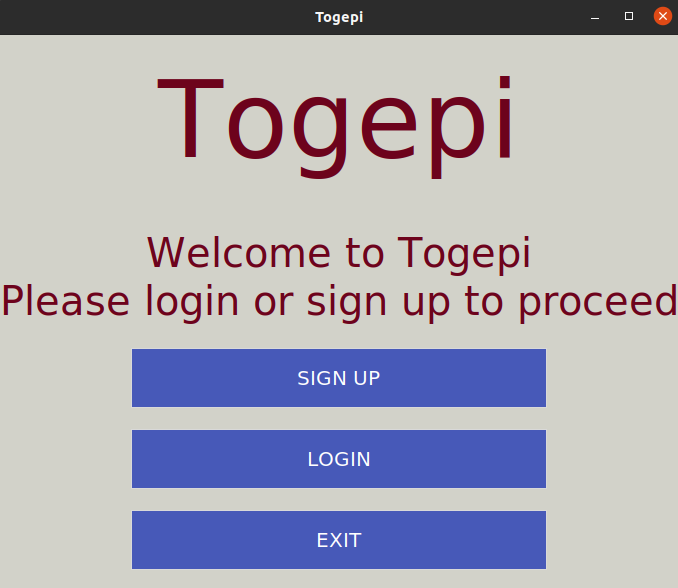
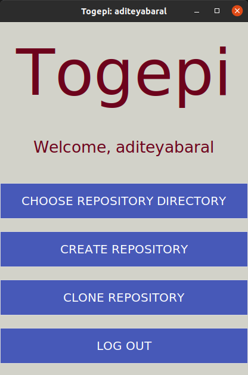
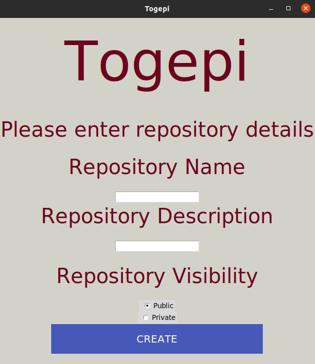
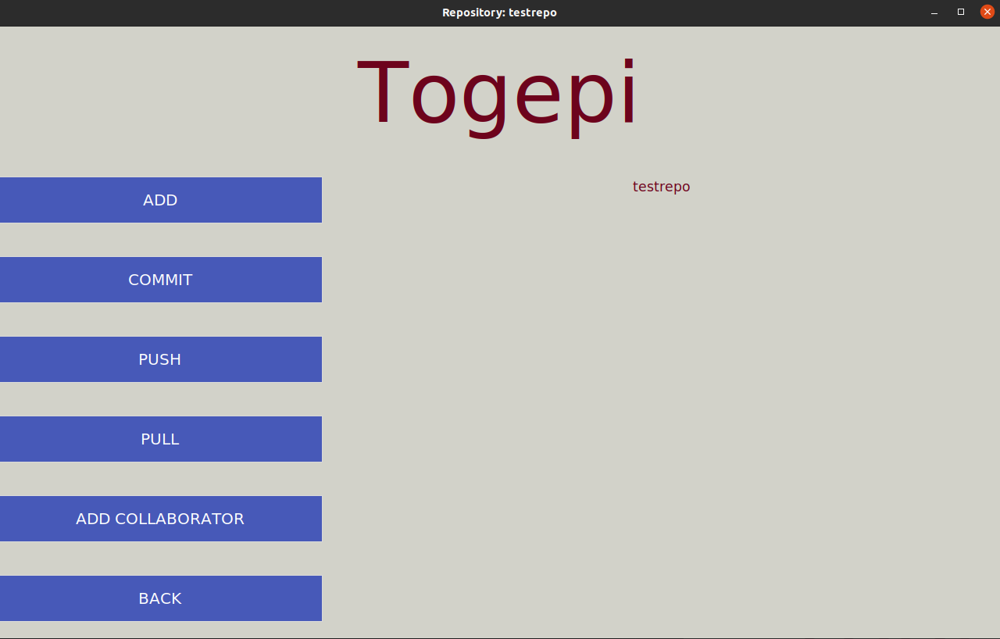

# Togepi

A version control system built using Python and DropBox API

<p align="center">
  
</p>

Togepi can be used both on command line as well as through a GUI window, however we do suggest using the CLI to access all of Togepi's features, due to certain implementation based restrictions in the GUI.

Togepi supports most major version control features such as `add`, `commit`, `pull`, `push`, `status`, `clone` to name a few. The CLI also features prominent CLI utility tools to help out such as `clear`, `cd`, `mkdir`, `rmdir`, `nano`, `ls` and `cat`.

The GUI interface is basic and supports only the core features. There are no plans to extend work on the GUI since the interface was included as a course deliverable.

# Setting up Togepi
1. Create a virtual environment using `virtualenv`
```bash
virtualenv togepi
source togepi/bin/activate
```
2. Install the dependencies using `pip3 install -r requirements.txt`
3. Create a `.env` file and add the following keys
```env
DATABASE_URL=
DB_URL=(same as above)
DROPBOX_API_KEY=
DROPBOX_API_SECRET=
DROPBOX_ACC_TOK=
```
4. Create the database schema for Togepi

You can create the schema for the database using `database.py` inside the `app` directory. Navigate into the folder, run `python3` and execute the following commands
```Python
>>> from database import db
>>> db.create_all()
```
Note that if you are running it via an online database such as Heroku-PostgreSQL, you will need to run the above commands on the hosted Python environment.

# How to use Togepi

## Command Line Interface

To run Togepi on command-line, run `python3 src/main.py`

If you would like to run with the debugger, use `python3 src/main.py debug`

```bash
Welcome to Togepi!
>>>
```

### User Level Functions

#### Create User

You can create users using `tgp user create`. This will create user specific directories on DropBox as well.

```bash
>>> tgp user create
Enter username: aronyabaksy
Enter email: abaksy@gmail.com
Enter password:
Creating ID: USER000003
New user successfully created.
```

#### Login as User

You can create users using `tgp user login`
```bash
>>> tgp user login
Enter username: aditeyabaral
Enter password: 
Welcome back, aditeyabaral
```

#### Logout

You can logout using `tgp user logout`
```bash
>>> tgp user logout
You have logged out.
```

### Repository Level Functions

To access repository functions, you need to be inside a directory with a `.togepi` subfolder. The `.togepi` subfolder handles all commit history, and stores the diffs in tracked files across commits.

You can either navigate to a directory with `cd` or clone or create a repository as required.

#### Creating Repositories

You can create a repository using `tgp init [REPOSITORY NAME]`. This will create a local directory with a `.togepi` subfolder to handle commit history. The repository will also gets created on DropBox.

```bash
>>> tgp init myfirstrepo
Enter repository description? [y/n]: y
Enter repository description (under 150 chars): this is myfirstrepo
Enter repository visibility [public/private]: public
New repository successfully created.
Uploading .togepi/tgpinfo.txt
```

#### Cloning a Repository
To clone a repository, it either needs to be public or you need to have collaborator access to it. Clone a repository using `tgp clone [USERNAME]/[REPOSITORY NAME]`

```bash
>>> tgp clone aditeyabaral/helloworld
Cloning repository helloworld...
Archive:  helloworld.zip
   creating: helloworld/
   creating: helloworld/.togepi/
 extracting: helloworld/.togepi/tgpinfo.txt
```

#### Tracking Files

You can track files using the `tgp add [.|FILEPATH FILEPATH ...]`. Using a `.` will track all files inside the directory recursively. 

```bash
>>> tgp add .
File ./helloworld.txt successfully tracked.
File ./.togepi/tgpinfo.txt successfully tracked.
```

#### Making Commits

You can create commits using `tgp commit [COMMIT MESSAGE]`. Once committed, diff files are generated and commit history is created in `.togepi`.

```bash
>>> tgp commit add helloworld.txt           
added changes: ./helloworld.txt
1 files changed: 1 addtions(+) 0 deletions(-)
```

#### Fetching and Displaying Status

You can fetch the commit history on the remote and compare it with your local working copy. To perform a check, run `tgp status`

```bash
>>> tgp status
modified: ./.togepi/tgpinfo.txt
modified: ./helloworld.txt
```

#### Pushing Changes

You can push your changes to the remote using `tgp push`. This will update the repository directory on DropBox with the files in your local repository directory.

```bash
>>> tgp push
Uploading helloworld.txt
Uploading .togepi/tgpinfo.txt
Uploading .togepi/COMMIT000005--2021-04-11-16:42:57/FILE000008.txt
```

#### Pulling Changes from Remote

You can pull changes from remote using `tgp pull`. Internally, a `tgp status` is also performed to check for diffs in each file.

```bash
>>> tgp pull
Pulling changes...
Archive:  myfirstrepo.zip
 extracting: myfirstrepo/hi.txt      
 extracting: myfirstrepo/helloworld.txt  
 extracting: myfirstrepo/.togepi/tgpinfo.txt  
   creating: myfirstrepo/.togepi/COMMIT000006--2021-04-11-18:49:18/
 extracting: myfirstrepo/.togepi/COMMIT000005--2021-04-11-16:42:57/FILE000008.txt  
 extracting: myfirstrepo/.togepi/COMMIT000006--2021-04-11-18:49:18/FILE000010.txt 
```

#### Adding Collaborators
To add a collaborator, you need to be the owner of the repository. Add a collaborator using `tgp repo add collab [USERNAME]`

```bash
>>> tgp repo add collab aronyabaksy
User aronyabaksy successfully added as collaborator.
```

### Command Line Tools
Togepi also features prominent command line utilities to allow users to quickly made file edits as well as move files and folders without leaving the application.

1. `cd [PATH]`
2. `ls [OPTIONAL=DIRECTORY PATH]`
3. `cat [FILE PATH]`
4. `mkdir [DIRECTORY PATH]`
5. `rmdir [DIRECTORY PATH]`
6. `nano [FILE PATH]`
7. `clear` or `cls`

### Help
Togepi also features a convenient `help` command to assist you in times of need.

```bash
>>> help
TOGEPI

Togepi is a version control system built using Python3 and DropBox API

1. User Commands

tgp create user -- Create an account
tgp user login username password -- Login to existing account

2. Repository Commands

tgp init repository_name -- Create a new repository
...
```

### Togepi

If you would like to see a cute Togepi, just type `togepi` 

```bash
>>> togepi
                            ...:`                 
           `....         ...    /                 
           /   `....` ...    `  `/                
          --        `-`     ``````:  .-.--......  
          /`               ```````:-.```````  `/  
          /`     ``.-.    ``..```````         .:  
 `..     `/`    --:d/    ```oo`:``````````````/   
-```--. .-`     -.:- +o+/```h+`/`````````````-`   
:`   `.:-: `.`   `` `sss-`````.`````````````-.    
`-`    `::..`:   .` .so/```````````````````.-     
 :```  `-    `:`-.-../-.-.``````````````````-     
  :````:`.`   -.     ``  :-```..-.   `.--...:....`
  `:----+o:               .-..`` :.`.---.`      --
   :..`:os`    :-..`       `` `.:/+-``-       `.: 
   /````..     :`...--`      -+o-/s- :```````.--  
   /```        +-+`-::/:-`   .so`/o+ -/.```./-`   
   +`::`   ````+/o`  -+:+-    +o+o/.``.---../     
   /soso-``  ``-++/./+++-``````-.``````````:`     
    oooos+.   ``/+++++:``````````..````````:      
    `/`/sos:`  ``//:-`````````.:+++/```` `:       
     `:`-oos+```````````````./++/o+:`  ``:        
       --.sos/`````````````:+o/.:+o`  `-.         
        `/os+`````````````+++o//+o-`.-.           
     `-..``.:---```````````-::///+:-/--`          
    :--`    `..:+-.----..----:/::.`   `.-.        
    -+....----.               `--.     .-:.       
                                 `....----
```


## Graphical User Interface

To run Togepi using a GUI, run `python3 src/gui.py`. The interface itself is easy and intuitive to use and should not take too much time understanding your way around it.

<p align="center">
  
</p>

### After Registering or Logging In

<p align="center">
  
</p>

### Creating a Repository

<p align="center">
  
</p>

### After Choosing a Repository

<p align="center">
  
</p>

Additional screenshots have been added to `img/gui` for reference.

# Contributing to Togepi

Contributions to Togepi are welcome, in the form of bug fixes as well as feature enhancements. We look forward to adding more features to the CLI, such as `forks` and `branches`.

# Acknowledgements

This project was made as a part of the Object Oriented Analysis and Design & Software Engineering Laboratory Course (UE18CS355) at PES University. 

[Aditeya Baral](https://github.com/aditeyabaral)<br>
[Aronya Baksy](https://github.com/abaksy)<br>
[Ansh Sarkar](https://github.com/anshsarkar)